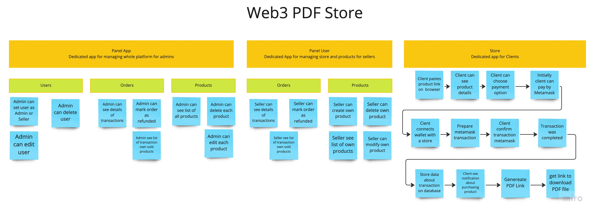

# Web3 PDF Store

This is a project based on Web3 transactions where users can pay and download PDF files without registration and fill
out forms.

I create an API (Nest.js) site responsible for handling and retrieving every request. Also in the future, I'll create
frontend apps to handle views and API requests. Frontend Framework: I don't know. Maybe Vue.js - I'm regular or React.js
I would like to learn this again and improve my skills in this project.

## Big Picture

Firstly I create big picture event storming, in which I describe most of the events/actions in the project.


## Setup project

```
git clone git@github.com:ThePatrykOOO/web3_pdf_store.git
cd web3_pdf_store
docker-compose up --build
```
